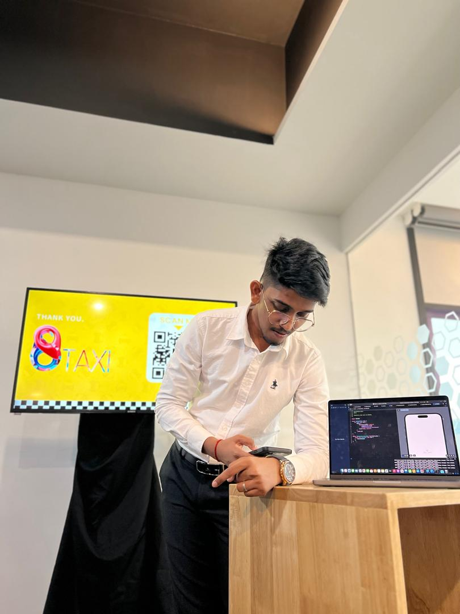

# Introduction

Hi! I'm Surenthar Rajamohan, a student in the Software Maintenance
and Evolution course.

As a Software Engineering student, I'm really excited to take WIF3005 because I know how important it is to keep software running smoothly and adapt it over time. I'm hoping to gain practical skills that will be useful in my future projects and career as a software engineer!

- **Fun fact**: I love playing games during my free time and I can't function without coffee haha.
- **Course expectations**: I’m looking forward to learning how to handle real-world challenges when it comes to maintaining and improving software, and I think this course will help me build better, long-lasting systems.

## GitHub Profile
You can view my personalized GitHub profile
[here](https://github.com/SurentharRajamohan).

